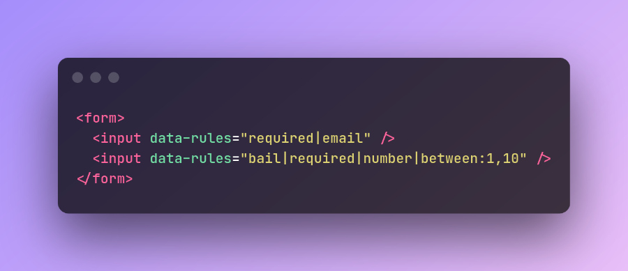

# Facile Validator

_This documentation is being completed..._

Laravel-inspired validation for HTML forms, built for simplicity of use: 😋


Facile (French word for "easy", pronounced `fa·sil`) is an HTML form validator that is inspired by Laravel's validation style and is designed for simplicity of use.

**[DEMO](https://upjs.github.io/facile-validator/)**

## Installation

```bash
$ npm i @upjs/facile-validator
```


## Usage

HTML:
```html
<form>
  <input data-rules="bail|required|number|between:1,10" />
</form>
```

The rules for every input are separated with a pipe character (vertical line) `|`. In this example, we've assigned four rules for that `input`: 

* bail
* required
* number
* between

<br/>

JavaScript:
```javascript
import { Validator, enLang as en } from '@upjs/facile-validator';

const form = document.querySelector('form');
const validator = new Validator(form, {
  lang: en,
});

form.addEventListener('submit', (e) => {
  e.preventDefault();
  validator.validate();
});
```
Now every input with `data-rules` attribute in the `form` will be validated. 


## Available Validation Rules:

- accepted
- required
- alpha
- alpha-num
- alpha-num-dash
- bail
- between
- digits
- email
- ends-with
- int
- integer
- max
- min
- num-dash
- number
- required
- size
- starts-with
- in

------

[`accepted`](/#accepted-rule)  
The input (checkbox, radio) must be checked:

```html
<input data-rules="accepted" />
```

------

`alpha`  
 The input value must contain only alphabetic characters.

```html
<input data-rules="alpha" />
```

------

`alpha-num`  
The input value must contain only alpha-numeric characters.

```html
<input data-rules="alpha-num" />
```

------

`alpha-num-dash`  
The input value must contain only alpha-numeric characters, dashes, and underscores.

```html
<input data-rules="alpha-num-dash" />
```

------

`bail`  
If a set of rules contains `bail` rule, the validation for the input will be stopped as soon as a rule fails, and then other rules will not be processed.

```html
<input data-rules="bail|required|number|between:1,10">
```

 *`required` rule will be processed and if it fails, other rules will not be processed.*

------

`between`  
The input value must be a number between the given range.

```html
<input data-rules="between:1,10" />
```

*The numbers lower than 1 and higher than 10 are not accepted.*

------

`digits`  
The input value must be a number with the given length.

```html
<input data-rules="digits:10" />
```

*Only a number with the length of 10 is accepted (e.g. 1234567890)*

------

`email`  
The input value must be an email.

```html
<input data-rules="email" />
```

------

`ends-with`  
The input value must end with the given substring.

```html
<input data-rules="ends-with:ies" />
```

*Only the words that end with <u>ies</u> (technologies, parties, allies, ...) are accepted.*

------

`int`  
The input value must be an integer (positive or negative).

```html
<input data-rules="int" />
```

You can also use `integer`

------

`max`  
This rule is used for multiple purposes.

With the combination with the `number` rule, the input value must be a number less than or equal to the given number:
```html
<input data-rules="number|max:50" />
```

*Only a number less than or equal to 50 will be accepted.*

If `max` is used without `number` rule, the input value is considered as a `string` and then the input value must be a string with a maximum length of the given number:

```html
<input data-rules="max:5" />
```

*Only strings with the length of 5 or less will be accepted.*

------

`min`  
This rule is used for multiple purposes.

With the combination with the `number` rule, the input value must be a number greater than or equal to the given number:

```html
<input data-rules="number|min:50" />
```

*Only a number greater than or equal to 50 will be accepted.*

If `min` rule is used without `number` rule, the input value is considered as a string and then the input value must be a string with a minimum length of the given number.

```html
<input data-rules="max:5" />
```

*Only strings with the length of 5 or higher will be accepted.*

------

`num-dash`  
The input value must contain only numeric characters, dashes, and underscores.

```html
<input data-rules="num-dash" />
```

*1000, 123-456, 123_456 are valid numbers for this rule.*

------

`number`  
The input value must be a number.

```html
<input data-rules="number" />
```

------

`required`  
The input must be filled.

```html
<input data-rules="required" />
```

------

`size`  
This rule is used for multiple purposes.

With the combination with the `number` rule, the input value must be a number equal to the given number:

```html
<input data-rules="number|size:1000" />
```

*Only 1000 is accepted.*

If used without `number` rule, the input value is considered as a string and then the input value must be a string with the exact length of the given number:

```html
<input data-rules="size:5" />
```

*Only the strings with the length of 5 are accepted.*

------

`starts-with`  
The input value must start with the given substring.

```html
<input data-rules="starts-with:app" />
```

*Only the words that start with <u>app</u> (apple, application, append, ...) are accepted.*

------

`in`  
The input value must be in the list of given values.

```html
<input data-rules="in:red,green,blue" />
```

*Only red or green or blue are valid inputs.*

`in` rule can also be used with a `<select multiple>` element. In this case, `in` rule should be used with `array` rule:

```html
<select data-rules="required|array|in:1,3" name="names[]" multiple>
  <option value="1">1</option>
  <option value="2">2</option>
  <option value="3">3</option>
</select>
```

*Only 1, 3 or both are accepted.*

------

## License

MIT
